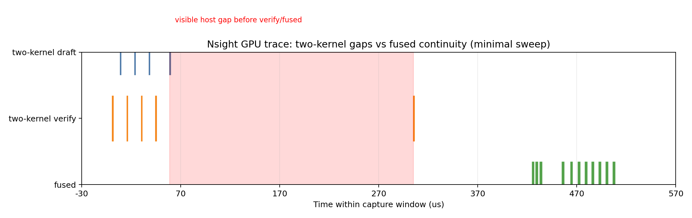
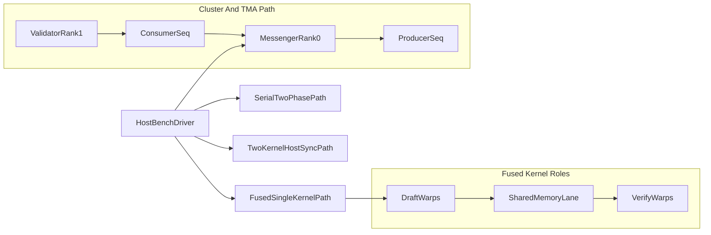

# Waiting is a Choice

Microbenchmarks for **asynchronous heterogeneous speculative decoding**. This is **not** an integrated vLLM/Triton stack. It isolates warp-specialization, cluster barriers, prefetch/compute overlap, and precision stubs so manuscript claims remain tied to reproducible kernels and CSV timelines.

## GPU Compatibility

The build defaults to `sm_120` (RTX 5070 Ti / Blackwell). **The core benchmark runs on any CUDA GPU sm_70 or newer.** Override the architecture at build time:

| GPU | `WIC_CUDA_ARCH` | Notes |
|---|---|---|
| A5000 / A4000 / A6000 (Ampere) | `86` | All core paths run; cluster/TMA paths skipped |
| A100 (Ampere) | `80` | Same as above |
| RTX 3000 series (Ampere) | `86` | Same as above |
| RTX 4000 series (Ada) | `89` | FP8 hardware path also active |
| H100 / H800 (Hopper) | `90` | Cluster + TMA paths also active |
| RTX 5000 series (Blackwell) | `120` | Default; all paths active |

Build for an A5000:

```bash
WIC_CUDA_ARCH=86 scripts/build.sh
```

**Paths silently skipped on pre-Hopper GPUs** (the benchmark prints "skipped" and continues — this is expected):
- `cluster_tma_dsmem_kv` — requires sm_90+ (Hopper+)
- `cluster_dsmem_demo` — requires sm_90+ (Hopper+)
- FP4 path — stub only on all hardware (not yet implemented)

Everything else — serial two-phase stream, two-kernel host-sync, fused single-kernel, KV tile prefetch, FP16/BF16 WMMA GEMMs — runs on Ampere and newer.

## What We Have Shown So Far

- The fused single-kernel path reduces orchestration overhead versus host-synchronized two-kernel execution in this microbenchmark setup (**1.56× median speedup** over two-kernel host-sync across 10 trials at n=256).
- Current 10-trial aggregate headline (`results/final_bench.csv`): fused latency is lower than two-kernel host-sync, but not lower than the serial two-phase stream baseline (0.83× serial/fused).
- Nsight timelines show where host-synchronization stretches the execution window compared with fused scheduling.
- These are kernel-level scheduling results, not end-to-end LLM serving claims.



## Memory Scope (Implemented vs Not Implemented)

Implemented in this repo:

- Shared-memory handoff in fused draft/verify kernels.
- KV-style tiled prefetch path (`k_kv_tile_pipeline`) for overlap experiments.
- Cluster TMA + DSMEM path (`k_cluster_tma_dsmem_kv`) with producer/consumer anti-lapping sequencing.
- Profiler-facing memory overlap instrumentation for timeline analysis.

Not implemented yet (out of current claim scope):

- Full LLM KV-cache lifecycle (allocation, paging, eviction, and long-context reuse).
- Multi-request serving memory manager behavior (fragmentation, contention, paging policy).
- End-to-end memory-efficiency metrics such as bytes/token under production traffic.

---

## Warp partitioning logic (deep dive)

The GPU code maps two conceptual warp groups onto the same streaming multiprocessor (SM):


| Role                   | Canonical responsibility                                                                       | Canonical resources                                                                               |
| ---------------------- | ---------------------------------------------------------------------------------------------- | ------------------------------------------------------------------------------------------------- |
| **Messenger / Draft**  | Speculative low-precision arithmetic and staging into shared/cluster-visible buffers           | Registers + shared memory for ephemeral tiles; occupies lower warp IDs inside `k_fused_pipeline`. |
| **Validator / Target** | Verifies speculative states (higher-precision or redundant math) consuming the staged payloads | Occupies upper warp IDs; guarded by `_syncthreads()` / cooperative cluster scopes.                |





Concrete implementations in-tree:

1. **`k_fused_pipeline` (`cuda/baselines.cu`)** splits the resident warps roughly in half (`is_draft_side`) and uses **static shared memory** (`__shared__ float sm[2048]`) as the lane between draft and verify phases. This models the *zero-external-launch* path that proves “waiting” is orchestration—not an SM limitation.
2. **`k_cluster_messenger_validator` (`cuda/dsmem_pipeline.cu`)** launches **two clustered thread blocks**, each exposing dynamic shared scratch. Explicit `cuda::launch::cluster_dims` synchronization (`cluster.sync()`) substitutes for distributed-shared-memory choreography when cross-block DSMEM primitives are gated by toolchain maturity. Messenger block 0 writes the global handshake buffer; validator block 1 consumes it—the same causal structure as DSMEM payloads.
3. **`k_kv_tile_pipeline` (`cuda/tma_prefetch.cu`)** reserves **warp groups** for prefetch and compute iterations over KV-shaped tiles (`tile_a`/`tile_b` double buffer). Prefetch lanes issue wide global reads; compute lanes perform dependent math concurrently on the trailing tile—a stand-in pattern for documenting **Nsight-visible memory/compute overlap** until CUTLASS-style TMA descriptors land in-repo.
4. **`k_cluster_tma_dsmem_kv` (`cuda/cluster_tma_dsmem.cu`)** is the **TMA + DSMEM slice** for Hopper+ (`sm_90` and newer): a **2×1×1 thread-block cluster** where rank **0** builds a **rank-3 `CUtensorMap`** over **flattened** KV (`globalDim = [tile_elems·num_tiles, 1, 1]`, `[tile_elems,1,1]` box, coordinates `(t·tile_elems, 0, 0)`), issues `cp.async.bulk.tensor` into the messenger’s `shared::cta` tile buffer, and pairs it with `mbarrier.arrive.expect_tx` (release, CTA-scoped) plus `mbarrier_try_wait_parity` for completion; rank **1** reads the tile through `cluster.map_shared_rank`, reduces ∑(x² + sin x) across the block, and atomically stores per-tile partials. Anti-lapping: rank 0 spins on a mapped `consumer_seq` (device `atomicAdd` from rank **1** on the messenger SMEM word) before issuing tile **t>0**; rank **0** still publishes a **producer** tile id after each TMA + fence. Dynamic SMEM is **128-byte–aligned**; **swizzle OFF**. **Pre-cluster** hardware keeps `dsmem_pipeline.cu` / `tma_prefetch.cu`; `launch_cluster_tma_dsmem_kv_demo` returns `cudaErrorNotSupported` when `prop.major < 9` or `cuTensorMapEncodeTiled` fails. Require `tile_elems · sizeof(float) ≡ 0 (mod 16)` (tensor stride alignment).

Occupancy takeaway: heterogeneous kernels pay in **register pressure** (`__launch_bounds__` hints annotate hot paths). When draft + validators share residency, spilled registers bounce through local DRAM and erase wins—benchmark with Nsight Compute (see [docs/profiling/nsight.md](docs/profiling/nsight.md)).

---

## Repository map

```
cmake/               # WIC_CUDA_ARCH defaulting to 120 for RTX Blackwell configs
cpu/                 # Greedy LM-head reference + OpenMP producer/consumer ring
cuda/                # Benchmark kernels + NVIDIA bench driver (`wic_cuda_bench`)
scripts/             # Build/env/microbench/nsys/roofline helpers
docs/profiling/      # Exact Nsight command recipes
paper/               # Full LaTeX manuscript (main.tex + references.bib)
results/             # CSV outputs (.gitignored large traces remain ignored)
Dockerfile           # CUDA 12.8+ reproducible toolchain
LICENSE              # MIT License
```

---

## Build & run

```bash
# Blackwell (default — RTX 5070 Ti, etc.)
scripts/build.sh

# Ampere — A5000, A4000, A6000, RTX 3000 series
WIC_CUDA_ARCH=86 scripts/build.sh

# Ampere — A100
WIC_CUDA_ARCH=80 scripts/build.sh

# Ada — RTX 4000 series
WIC_CUDA_ARCH=89 scripts/build.sh

# Hopper — H100/H800
WIC_CUDA_ARCH=90 scripts/build.sh
```

After building, run the CPU demo and minimal benchmark:

```bash
./build/wic_cpu_demo --bind --threads 4
scripts/run_microbench.sh
```

For roofline analysis, the `--bench-scope full` run produces `fp16_matmul_wmma_64` rows needed by the roofline scripts. The committed headline artifact (`results/final_bench.csv`) uses `minimal` scope and does not contain those rows. Run a full-scope sweep first:

```bash
OUT=results/microbench.csv scripts/run_microbench.sh --bench-scope full --skip-correctness --iters 30 --warmup 5
scripts/roofline.py --csv results/microbench.csv
python3 scripts/roofline_measured.py --bench-csv results/microbench.csv --peak-tflops 80 --peak-mem-gbps 850
```

Additional `wic_cuda_bench` flags (publication workflow):


| Flag                          | Purpose                                                                                                      |
| ----------------------------- | ------------------------------------------------------------------------------------------------------------ |
| `--bench-scope <minimal\|core\|full>` | Selects headline-only, core, or full benchmark coverage. |
| `--stochastic-verify-iters N` | Host-driven draft corruption (~20% Bernoulli vs reference); device flags mismatches; asserts 100% detection. |
| `--skip-fused-correctness`    | Skips fused-vs-two-kernel check only.                                                                        |


NVTX ranges (`WIC:*`) appear in Nsight Systems when CUDA `nvtx3` headers are available at build time.

Environment notes:


| Variable                       | Meaning                                                                                                                           |
| ------------------------------ | --------------------------------------------------------------------------------------------------------------------------------- |
| `OMP_PROC_BIND` / `OMP_PLACES` | Set implicitly via `./wic_cpu_demo --bind` (`spread`, `cores`) to mimic deterministic socket pinning analogous to warp residency. |
| `WIC_CUDA_ARCH`                | Passed through `cmake` (`scripts/build.sh` defaults to **120**). Override for non-Blackwell GPUs, e.g. `WIC_CUDA_ARCH=89`.        |


---

## CPU demo & greedy parity

`wic_cpu_demo` verifies that the specialized OpenMP drafting/verification pathway matches greedy sampling on deterministic synthetic weights (`cpu/greedy_reference.cpp`). `scripts/compare_cpu_parity.sh` wraps the parity check while allowing `V`, `H`, and `STEP`/`SEED` environment overrides:

```bash
V=768 H=128 STEPS=32 SEED=2 scripts/compare_cpu_parity.sh --draft 2 --verify 2
```

---

## Comparators versus HuggingFace / vLLM

Full framework stacks multiplex CPU scheduling, graph capture, quantization, KV paging, NCCL collectives, and more—these contributions are orthogonal to the kernels above. Whenever you cite end-to-end speedups *vs.* HuggingFace `generate()` or vLLM, treat them as **system-level anecdotes** assembled outside this repo unless you wire explicit benchmarking harnesses. The authoritative artifacts here are **`wic_cuda_bench` timings + CSV** and Nsight timelines.

---

## Roofline methodology

[scripts/roofline.py](scripts/roofline.py) prints a scaffold using CSV row `fp16_matmul_wmma_64` by default.

For claims tied to **measured** hardware ceilings, capture peaks with `ncu`/`memcpy` sweeps then run [scripts/roofline_measured.py](scripts/roofline_measured.py) (`--peak-tflops`, `--peak-mem-gbps`). Register/occupancy capture workflow: [docs/profiling/occupancy.md](docs/profiling/occupancy.md).

---

## Cascaded speculation (future work outline)

Supporting **multiple draft models** concurrently implies:

1. Expanding DSMEM / cluster ring epochs with **explicit sequence numbers** to prevent validators from overtaking stale draft buffers.
2. Duplicating prefetch engines (conceptually multiple `k_kv_tile_pipeline` instances) multiplexed onto distinct global KV segments.
3. Revisiting warp budgets: cascading increases **register footprints** unless draft models shrink to quantized experts.

Discuss trade-offs openly in manuscripts; the codebase currently instantiates single-tier draft/target roles to keep profiler diff clean.

---

## Container workflow

```bash
docker build -t wic:devel .
docker run --gpus all -it wic:devel ./build/wic_cuda_bench --skip-fused-correctness --iters 30
```

The optional flag `--skip-fused-correctness` skips only the early fused-vs-two-kernel host check (which can fail on some driver/tuning combinations while other paths are still valid). Use `--skip-correctness` to disable all checks, or omit both to run the full suite.

The image pins **CUDA 12.8.0-devel** (`nvidia/cuda:12.8.0-devel-ubuntu24.04`). Match host drivers accordingly.

---

## License

This project is released under the [MIT License](LICENSE).
